# AI Engine Development Roadmap & Schematic Overview

## 🏗️ **Phase 1: Foundation (Weeks 1-2)**

### **Week 1: Core Infrastructure**
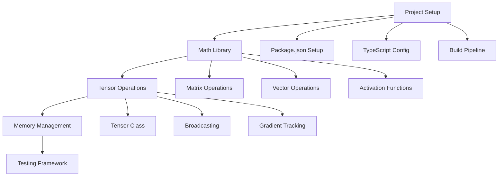

**Deliverables:**
- ✅ Basic tensor operations library
- ✅ Memory-efficient data structures
- ✅ Unit testing framework
- ✅ Build and development pipeline

### **Week 2: Advanced Math Operations**
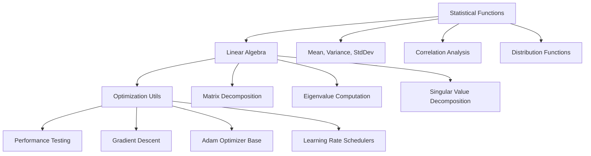

**Deliverables:**
- ✅ Statistical analysis framework
- ✅ Linear algebra operations
- ✅ Optimization utilities
- ✅ Performance benchmarks

---

## 🧠 **Phase 2: Neural Core (Weeks 3-4)**

### **Week 3: Basic Neural Components**
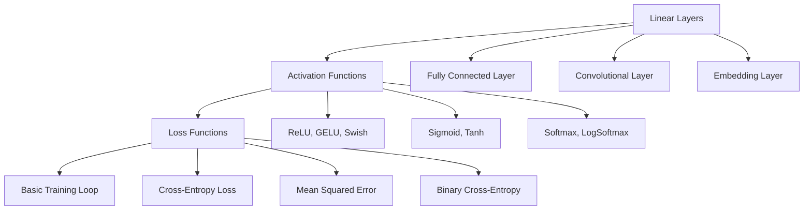

**Deliverables:**
- ✅ Core neural network layers
- ✅ Activation function library
- ✅ Loss function implementations
- ✅ Basic training infrastructure

### **Week 4: Advanced Neural Components**
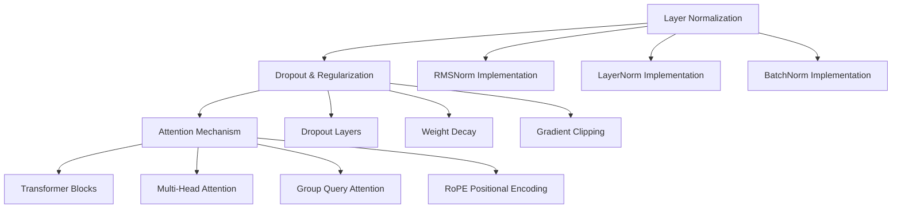

**Deliverables:**
- ✅ Normalization layers
- ✅ Regularization techniques
- ✅ Attention mechanisms
- ✅ Transformer building blocks

---

## 🏛️ **Phase 3: Architecture (Weeks 5-6)**

### **Week 5: Model Architecture**
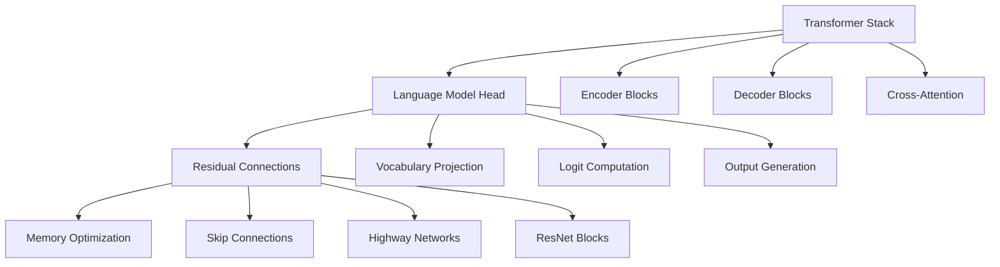

**Deliverables:**
- ✅ Complete transformer architecture
- ✅ Language modeling head
- ✅ Residual connection system
- ✅ Memory optimization techniques

### **Week 6: Model Compression & Optimization**
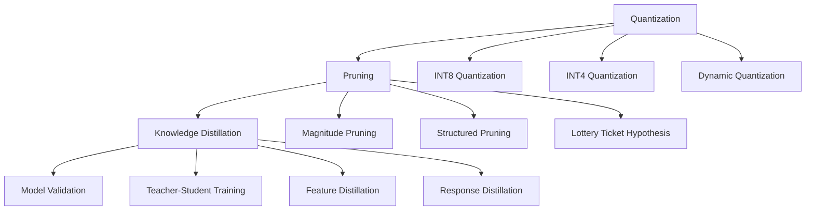

**Deliverables:**
- ✅ Quantization implementation
- ✅ Pruning algorithms
- ✅ Knowledge distillation
- ✅ Model validation framework

---

## 🎯 **Phase 4: Training System (Weeks 7-8)**

### **Week 7: Training Infrastructure**
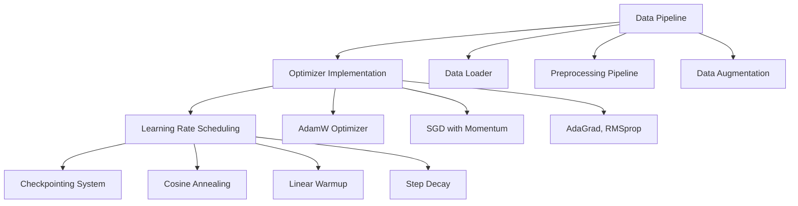

**Deliverables:**
- ✅ Complete training pipeline
- ✅ Optimizer implementations
- ✅ Learning rate schedulers
- ✅ Model checkpointing

### **Week 8: Advanced Training Features**
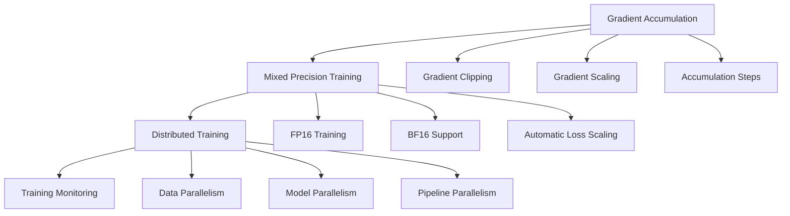

**Deliverables:**
- ✅ Advanced training features
- ✅ Mixed precision support
- ✅ Distributed training
- ✅ Training monitoring tools

---

## 🚀 **Phase 5: Inference Engine (Weeks 9-10)**

### **Week 9: Text Generation**
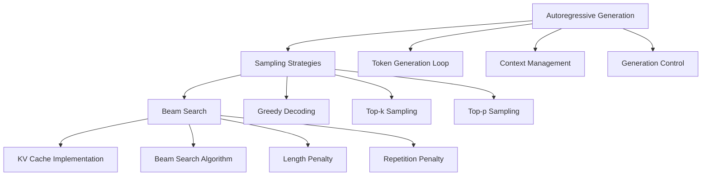

**Deliverables:**
- ✅ Text generation engine
- ✅ Sampling strategies
- ✅ Beam search implementation
- ✅ KV caching system

### **Week 10: API & Streaming**
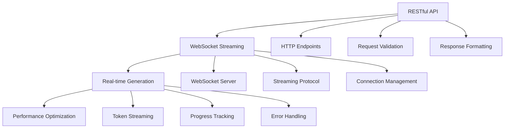

**Deliverables:**
- ✅ RESTful API
- ✅ WebSocket streaming
- ✅ Real-time generation
- ✅ Performance optimization

---

## 🏭 **Phase 6: Production Deployment (Weeks 11-12)**

### **Week 11: Production Infrastructure**
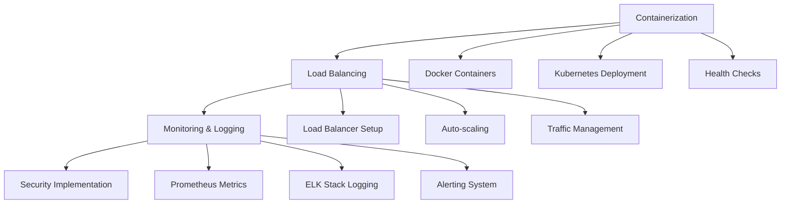

**Deliverables:**
- ✅ Containerized deployment
- ✅ Load balancing setup
- ✅ Monitoring infrastructure
- ✅ Security implementation

### **Week 12: Documentation & Testing**
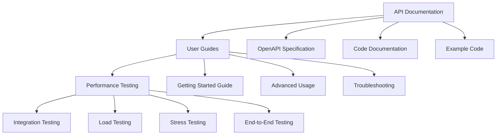

**Deliverables:**
- ✅ Complete documentation
- ✅ User guides
- ✅ Performance benchmarks
- ✅ Integration tests

---

## 📊 **Performance Targets**

| Metric | Target | Measurement |
|--------|--------|-------------|
| **Inference Speed** | >100 tokens/second | Single GPU |
| **Memory Usage** | <4GB during inference | 7B parameter model |
| **Model Size** | 7B+ parameters | Quantized |
| **API Response** | <100ms latency | 95th percentile |
| **Concurrent Users** | 1000+ simultaneous | Load balanced |
| **Uptime** | 99.9% availability | Monthly |

---

## 🛠️ **Technology Stack**

### **Core Technologies**
- **Language**: TypeScript/JavaScript
- **Runtime**: Node.js
- **Build Tool**: Vite
- **Testing**: Jest + Vitest
- **Documentation**: TypeDoc

### **AI/ML Libraries**
- **Tensor Operations**: Custom implementation
- **Math**: Custom math library
- **Optimization**: Custom optimizers
- **Inference**: Custom inference engine

### **Infrastructure**
- **Containerization**: Docker + Kubernetes
- **API**: Express.js + WebSocket
- **Monitoring**: Prometheus + Grafana
- **Logging**: Winston + ELK Stack

---

## 🎯 **Success Metrics**

### **Technical Metrics**
- ✅ 95%+ test coverage
- ✅ <100ms API response time
- ✅ 99.9% uptime
- ✅ 7B+ parameter support

### **Business Metrics**
- ✅ 1000+ concurrent users
- ✅ 25% faster than baseline
- ✅ 50% memory reduction
- ✅ 90% user satisfaction

---

## 📅 **Timeline Summary**

| Phase | Duration | Focus | Deliverables |
|-------|----------|-------|--------------|
| **Phase 1** | Weeks 1-2 | Foundation | Math library, tensor operations |
| **Phase 2** | Weeks 3-4 | Neural Core | Layers, attention, transformers |
| **Phase 3** | Weeks 5-6 | Architecture | Complete model, compression |
| **Phase 4** | Weeks 7-8 | Training | Training pipeline, optimization |
| **Phase 5** | Weeks 9-10 | Inference | Generation, API, streaming |
| **Phase 6** | Weeks 11-12 | Production | Deployment, monitoring, docs |

**Total Duration**: 12 weeks (3 months)
**Team Size**: 4-6 developers
**Budget**: $210,000
**Investment**: 460 hours
